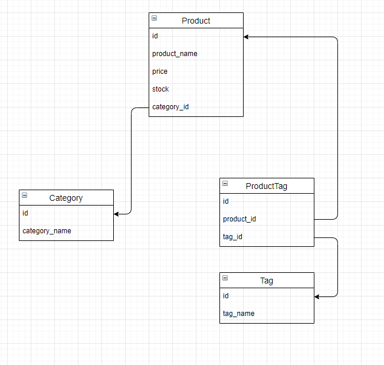

# eCommerce Tracking API

## By: David Lucio

### Table of Contents

* [Installation](#installation)
* [Usage](#usage)
* [Contributing](#contributing)
* [Tests](#tests)
* [Questions](#questions)

&nbsp;

&nbsp;

> ## **Description** 
> API and routes for an eCommerce tracking application. Built for the UW Web Development Bootcamp. 
> 
> &nbsp;
>
> ## **Tech used** 
> Node.js, SQL  
>  

*Completed Assignment*: [Deployment Link](https://github.com/davidlucio/ecommercebackend_HW13)

### **Video example [HERE](https://www.youtube.com/watch?v=fGiCGRK04V4)**
### **Relational Tree**:

&nbsp;

## **Installation**  
npm i mysql -u root -p [Login to database] source db/schema.sql quit [Back on terminal] node seeds/index.js node index.js  

&nbsp;

## **Usage**  
Ensure you have mysql working on your machine. The NPM installer should already be set for dependencies.  

&nbsp;

## **Contributing**
Clone the repository separately, and contact david.a.lucio@gmail.com for other contribution requests.  

&nbsp;

## **Tests**  
Test cases are included in the seeds/index.js file, and connections were made via Insomnia (video link above)  

&nbsp;

## **Questions**  

Email: david.a.lucio@gmail.com

GitHub: [davidlucio](http://github.com/davidlucio)  

LinkedIn: [davidlucio](https://www.linkedin.com/in/davidlucio)